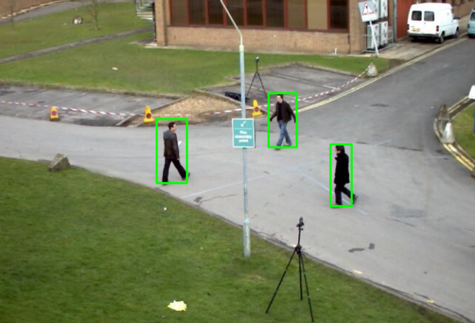
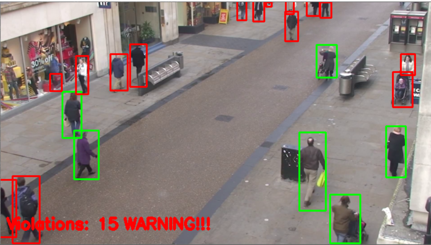

# YOLO-Distancing

This repo contains the source code for checking if people in a video maintain social distancing or not.
The covid pandemic has shocked the world and the best way of  prevention at this moment is practicing **Social Distancing** that is maintaining atleast 50 cm distance from other people.
This method reduces the chances of mass spread of infection.
But with such huge population monitoring social distancing at each place and at every moment is a cubersome procedure which itself would require huge workforce, but this problem can be easily solved using the **AI YOLO Distancing**.

This program uses deep learning-based model **YOLO- You Only Look Once: Unified, Real-Time Object Detection**, which is an object detector capable of super real-time object detection, obtaining 45 FPS on a GPU. This model is trained on **COCO dataset** which consists of 80 labels.
There were basically three main steps involved in over seeing the social distancing.

 ## (1)Detecting human and using YOLO model

 ## (2)Computing pairwise distances of all human objects detected in the video frame using euclidean

 ## (3)Producing output 

In the given image green boxes are indicating that people are at safe distance i.e.atleast 50 cm apart.
In the following image we can see that there are 15 violations indicated by the program(the people in red boxes)that is there are 15 people violating the social distancing norm at that moment which is dangerous and thus the warning sign appears.

